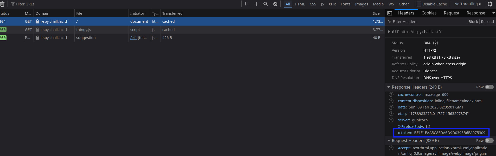
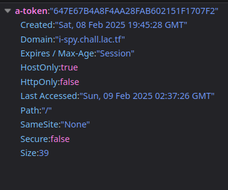
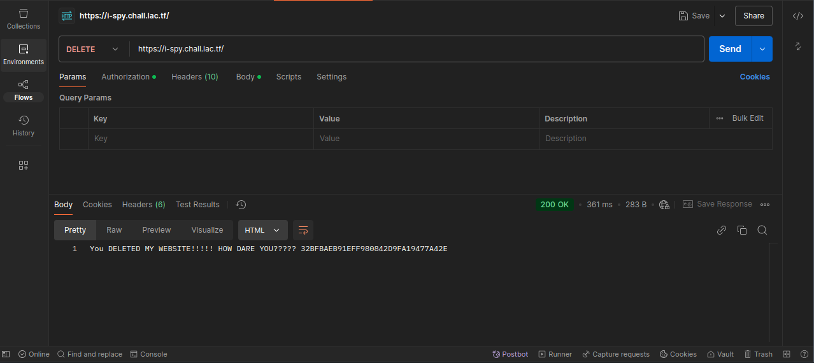
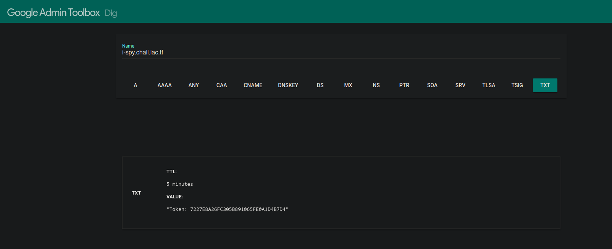

# I Spy

Web, easy

Solved by: @mud-ali

>>> I spy with my little eye...
>>> 
>>> A website!

Basically, this is an intro web chall that makes you look at different tools and collect tokens located there

1. token given to you: B218B51749AB9E4C669E4B33122C8AE3
2. right in the html (Inspect Element) you see the token at the top of the body tag
```html
<body>
    <!-- Token: 66E7AEBA46293C88D484CDAB0E479268 -->
    <div class="container">
```
3. auto printed in the console: `Token: 5D1F98BCEE51588F6A7500C4DAEF8AD6`
4. in the css code, which can be found in firefox dev tools > style editor > styles.css
```css
/* Token: 29D3065EFED4A6F82F2116DA1784C265 */

:root {
  --primary: #f44d8a;
  --background: #f5f6fa;
  --card: #ffffff;
  --text: #2c3e50;
  --error: #e74c3c;
  --success: #2ecc71;
}
```
5. its in the javascript code (sources tab on chrome dev tools, debugger on firefox)
```js
// Token: 9D34859CA6FC9BB8A57DB4F444CDAE83
// You do not need to deobfuscate this code.
```
6. they say its in the headers, so i checked the network tab to view the request and response headers needed to load the site

 

7. token in a cookie --> so i checked the storage tab of firefox's devtools (probably application for chromium browsers) and found the cookie:



8. the hint said "where the robots are forbidden..." so i checked robots.txt, which is a standard to tell web crawlers (like the google indexer) what pages not to index. The robots.txt page is located at [https://i-spy.chall.lac.tf/robots.txt](https://i-spy.chall.lac.tf/robots.txt) and it says that /a-magical-token.txt is disallowed. Since the robots.txt protocol is just a recommendation, we can still access this page. Sure enough, we see this: `Token: 3FB4C9545A6189DE5DE446D60F82B3AF`

9. The next one, notably, is found "where Google is told what pages to visit and index...". While `robots.txt` tells robots where not to look. we can go to /sitemap.xml to find where to look. As expected, a token is in the comments above the XML data.

10. This one asks us to make a DELETE HTTP request to the page. While this type of request usually indicates that some data should be deleted, it can be used without actually affecting anything. I used the postman application for this, although curl would be sufficient.



11. This step probably took the longest. It asks us to look at the TXT records of the subdomain i-spy.chall.lac.tf. There is a command line tool called `dig` that is useful for this, but we can also just use [Google's wrapper tool](https://toolbox.googleapps.com/apps/dig/#TXT/). Enter the URL `i-spy.chall.lac.tf` exactly (I messed up and used a slash, which didn't work) and we get the token.



And that's it! We get the flag: `lactf{1_sp0773d_z_t0k3ns_4v3rywh3r3}`
