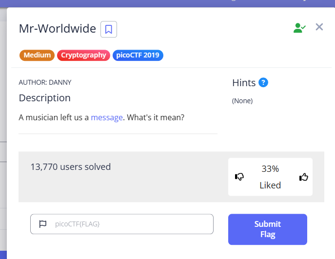

Mr-Worldwide is a medium difficulty cryptography challenge that has you decode a message that's encrypted with geographic coordinates. 

Here's the challenge statement: 

When we download the message, we get this string: 
picoCTF{(35.028309, 135.753082)(46.469391, 30.740883)(39.758949, -84.191605)(41.015137, 28.979530)(24.466667, 54.366669)(3.140853, 101.693207)_(9.005401, 38.763611)(-3.989038, -79.203560)(52.377956, 4.897070)(41.085651, -73.858467)(57.790001, -152.407227)(31.205753, 29.924526)}

Now, to solve this challenge, I had to go to a geographic coordinate finder website called https://gps-coordinates.org/ and type out the latitude and longitude for each set of coordinates. 

Now, when I did this, I noticed a pattern. My first instinct was that each set of coordinates corresponded to a letter, and I thought that the letter was the first letter of each city that popped up for each set of coordinates. 

When I decoded the string, I got this:
picoCTF{KODIAK_ALASKA}. 

What makes me believe that this is the flag I'm looking for is that when I was doing some research on Mr. Worldwide, I found out that in 2012 he visited Kodiak, Alaska to go to a Walmart there. 

When I input the flag in, I got this!

